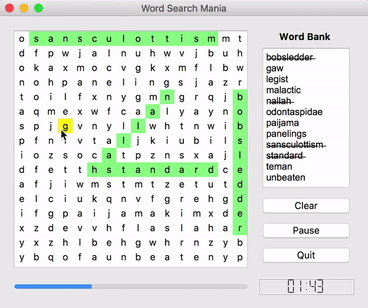

# Word Search Mania
Word Search Mania is a full featured customizable Python 3 word search game created using the PyQt5 framework. With Word Search Mania, words are randomly pulled out of a [dictionary text file](https://github.com/grantjenks/free-python-games) which contain around 370K words. A custom word bank can also be created in the customization menu. 

## Demo

